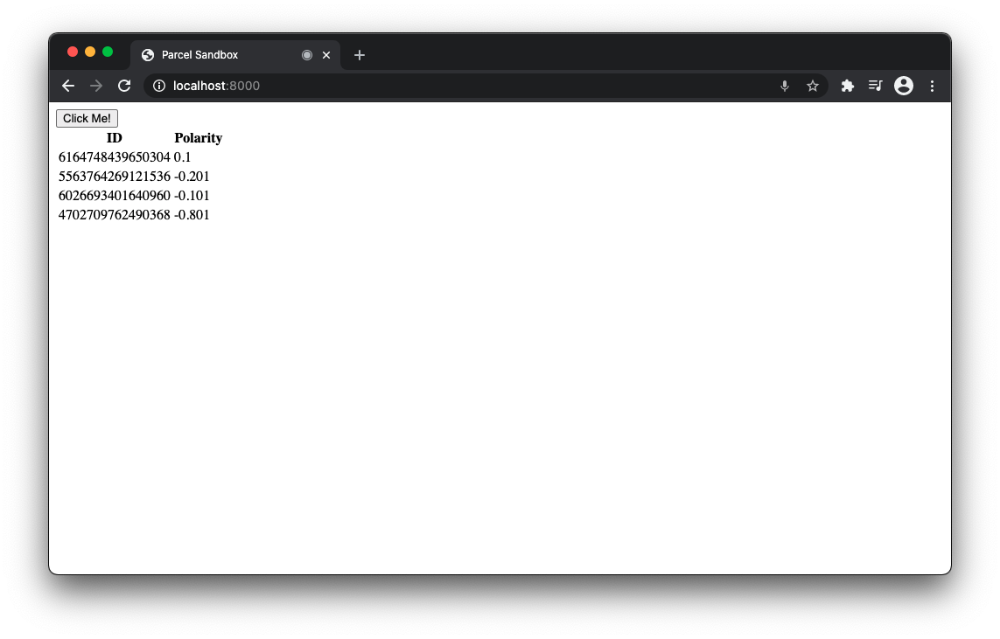

# Real Time Sentiment Analysis with WebSockets 

============================

Symbl's APIs empower developers to enable: 

- **Real-time** analysis of free-flowing discussions to automatically surface highly relevant summary discussion topics, contextual insights, suggestive action items, follow-ups, decisions, and questions.
- **Voice APIs** that makes it easy to add AI-powered conversational intelligence to either [telephony][telephony] or [WebSocket][websocket] interfaces.
- **Conversation APIs** that provide a REST interface for managing and processing your conversation data.
- **Summary UI** with a fully customizable and editable reference experience that indexes a searchable transcript and shows generated actionable insights, topics, timecodes, and speaker information.

# Your Integration Guide's Purpose 

Enable real-time sentiment analysis through Symbl.ai's sentiment analysis API. The demo is designed to show that sentiments may be logged messages in real-time. 

 * [Setup](#setup)
 * [Integration](#integration)
 * [Conclusion](#conclusion)
 * [Community](#community)

## Setup 
The first step to getting setup is to [sign up][signup]. After signing up, add your `x-api-key` as the value for the `accessToken`. Create a unique meeting ID with your email. 

## Integration 

To run the app, you have to ensure that you encounter neither an error with CORS nor with a local server. You download a CORS extension to handle CORS. The second step is to create a Python `http` server in the repo's directory. 

`python3 -m http.server 8000`

 After creating the local server, you press the button to initiate the WebSocket connection. Begin speaking. With the WebSocket connection established, your console should log events for messages. As these messages are logged, a table populates with the message IDs with their corresponding values for polarity. 

## Conclusion 

If your table populated with values for polarity, then you successfully ran the demo. 

## Community 

 If you are having trouble, check out our [API overview](api_overview), our [`cURL`](curl) cheatsheet or test your endpoints in [Postman](postman). If you have any questions, feel free to reach out to us at devrelations@symbl.ai or through our [Community Slack][slack] or our [developer community][developer_community]. 

This guide is actively developed, and we love to hear from you! Please feel free to [create an issue][issues] or [open a pull request][pulls] with your questions, comments, suggestions and feedback. If you liked our integration guide, please star our repo!

This library is released under the [MIT License][license]

[license]: LICENSE.txt
[telephony]: https://docs.symbl.ai/?&_ga=2.164569275.526040298.1609788827-1505817196.1609788827#voice-api
[websocket]: https://docs.symbl.ai/?_ga=2.96332568.526040298.1609788827-1505817196.1609788827#ws-voice-api-realtime-websocket
[developer_community]: https://community.symbl.ai/?_ga=2.134156042.526040298.1609788827-1505817196.1609788827
[slack]: https://join.slack.com/t/symbldotai/shared_invite/zt-4sic2s11-D3x496pll8UHSJ89cm78CA
[signup]: https://platform.symbl.ai/?_ga=2.63499307.526040298.1609788827-1505817196.1609788827
[issues]: https://github.com/symblai/real-time-sentiment-analysis-with-websockets/pulls/issues
[pulls]: https://github.com/symblai/real-time-sentiment-analysis-with-websockets/pulls

[api_overview]: https://docs.symbl.ai/#getting-started
[postman]: https://docs.symbl.ai/docs/tools/postman/
[curl]: https://docs.symbl.ai/docs/tools/#curl

